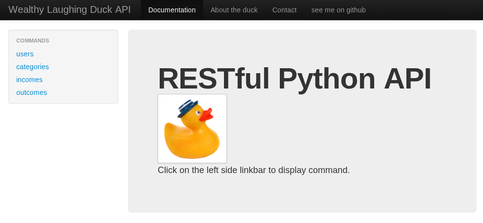
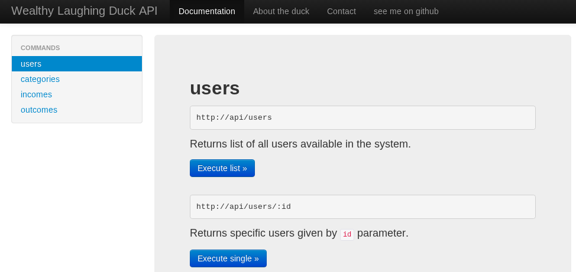
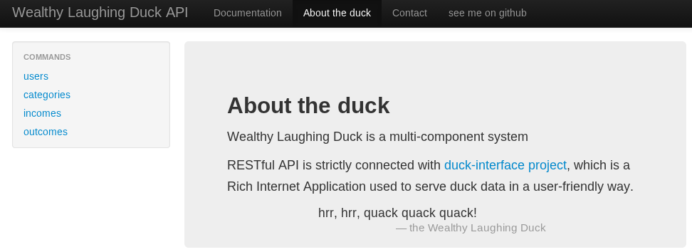
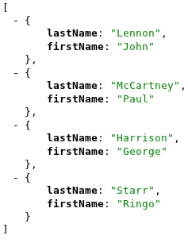

RESTful API in Python
=====================

software used
-------------

 * django version: 1.5.x
 * tastypie (provides RESTful API builder), [installation](http://django-tastypie.readthedocs.org/en/latest/tutorial.html#installation)
 * PyYAML (supports YAML format in the API, `sudo pip install pyyaml`)

available screenshots
---------------------

